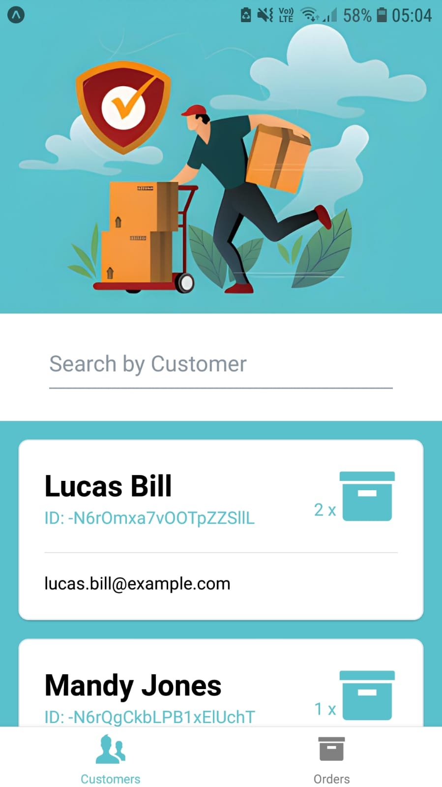

# 🚚 UPS-Clone

UPS clone app created using GraphQL and StepZen with existing database.

## ✨ Getting Started

1. Clone this project
2. Run `npm i` in the terminal to install all dependencies for your project.
3. Add your own `API_ENDPOINT_URL` and the `STEPZEN_API_KEY` in the `App.jsx`

## ⚙️ Tech Stack

1. React Native
2. Typescript
3. Firebase
4. GraphQL
5. StepZen
6. Tailwind CSS

## 📸 Screenshots

    

        
        
    

    

        
        
    

## 🙏 Special Thanks

**This project was completed with the help of [UPS Clone by Sonny Sangha](https://youtu.be/hvvWv2GLWss).**
